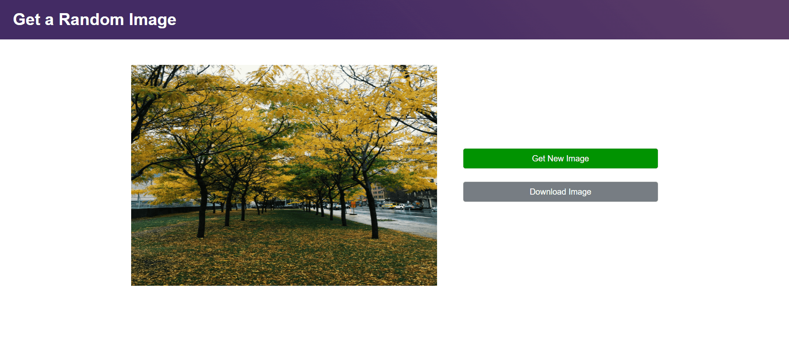

# 🖼️ RanPixel

**RanPixel** is a minimal and responsive web app built with **React.js** that fetches and displays random images from the **Unsplash API**. On initial load, a batch of random images is fetched once, and the user can explore new images instantly with a single click without additional API calls. Users can also download any displayed image with one click.

---

## 🚀 Features

- 🖼️ Fetches a **batch of random images** using Unsplash API
- 🔄 **Get New Image** button shows a different random image from the batch
- 📥 **Download Image** button to save the currently displayed image
- ⚡ Fast and responsive UI without hitting the API multiple times
- 📱 Fully **responsive design** for all screen sizes

---

## 🛠️ Tech Stack

- **React.js**
- **JavaScript (ES6+)**
- **HTML5/CSS3**
- **Tailwind CSS**
- **Unsplash Developer API**

---

## 📸 Live Demo

🔗 [View RanPixel Live](https://ranpixel.vercel.app/)

---

## 🧠 Implementation Details

- On **page load**, RanPixel fetches 30 random images using:
  > https://api.unsplash.com/photos/random?client_id=${YOUR_UNSPLASH_ACCESS_KEY}&count=30
- The images are stored in local state.
- Each time the **"Get New Image"** button is clicked, a new image is selected using JavaScript's `Math.random()` from the pre-fetched list.
- This reduces API calls and improves performance, while still maintaining randomness.

---

## 📥 Installation & Setup

### 1. Clone the Repository

git clone `https://github.com/sk-shahnawazkhan/ranpixel.git`  
cd ranpixel

### 2. Install Dependencies

✓ npm install  
✓ npm install tailwindcss @tailwindcss/vite  
✓ npm install @fontsource/inter

> 💡**Note:** You need to install dependencies before runing the app.  
> In case of any issues, refer to the official documentation.

### 3. Add Your Unsplash Access Key

Create a .env.local file in the root directory and add your Unsplash Access Key. Don't forget to add it to .gitignore file.  
VITE_ACCESS_KEY=your_access_key(Add it to .env.local for Local/Development environment)  
ACCESS_KEY=your_access_key(Add it to Vercel/Netlify environment variables)

### 4. Start the development server

Use `npm run dev` to start the application.

---

## 📸 Screenshots

---

## 🎯 Project Highlights

This project was built to strengthen understanding of:

- Working with third-party REST APIs
- React functional components and hooks (useState, useEffect)
- Efficient client-side data handling
- Clean UI and responsive

---

## 👨‍💻 Author

Developed by [Shahnawaz Khan](https://shahnawazkhan.vercel.app/)  
Frontend Developer | React Developer  
[Portfolio](https://shahnawazkhan.vercel.app/) • [Linkedin](https://www.linkedin.com/in/sk-shahnawazkhan) • [Github](https://github.com/sk-shahnawazkhan)
